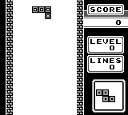

# Claude Plays Tetris
An implementation of Claude playing Tetris using the PyBoy emulator.

<p align="center">
  
</p>

## Setup
1. Clone this repository
2. Install the required packages:
   ```
   pip install -r requirements.txt
   ```
3. Set up your Anthropic API key as an environment variable:
   ```
   export ANTHROPIC_API_KEY=your_api_key_here
   ```
4. Place your Tetris ROM file in the root directory (you need to provide your own ROM)

## Usage
Run the main script:
```
python main.py
```

## Implementation Details

### Components
- `agent.py`: Main agent class that uses Claude to play Tetris
- `emulator.py`: Wrapper around PyBoy with helper functions
- `apiutils.py`: Utilities for interacting with the Anthropic API
- `prompts.py`: Contains prompts used by the agent
- `config.py`: Contains model settings

### How It Works
1. The agent captures a screenshot from the emulator
2. It reads the game state information from memory
3. It sends the screenshot and game state to Claude
4. Claude responds with explanations and emulator commands
5. The agent executes the commands and repeats the process

## Acknowledgements
This project is based on [ClaudePlaysPokemonStarter](https://github.com/davidhershey/ClaudePlaysPokemonStarter).